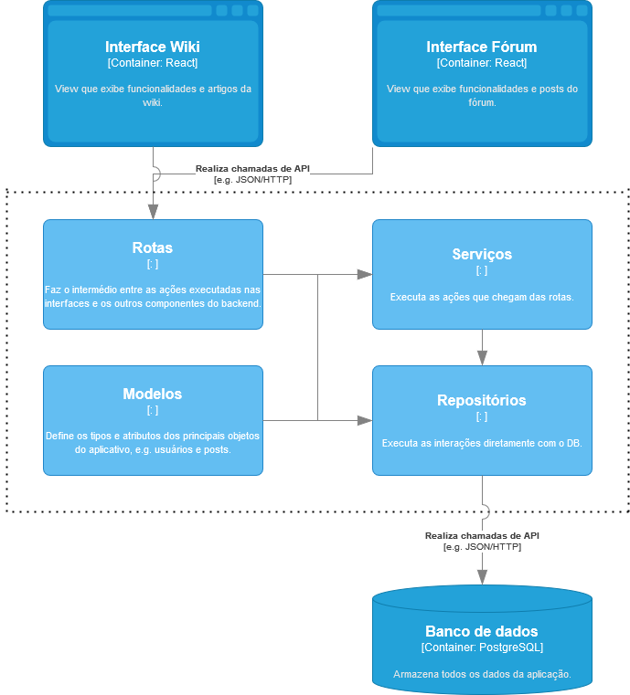

# Projeto Wiki + Repo

## Tema

Repositório/Wiki e fórum sobre conteúdos associados a disciplinas da Unicamp

## Ideia

A ideia do projeto é desenvolver uma plataforma que possibilite a publicação, manutenção e edição de páginas que contenham conteúdo multimídia oferecido normalmente em disciplinas e que possam ser criadas colaborativamente, inclusive pelos alunos. Adicionalmente, a plataforma irá conter um fórum simples que possibilite com que alunos publiquem dúvidas e respostas sobre os conteúdos englobados.

## Integrantes

Caio Petrucci dos Santos Rosa, 248245
Gabriel Gardini, 246289
Gustavo Eugenio John, 248318
Luan Augusto Fazolin, 182236
Paulo Vinícius Pinto, 242863

# Diagrama arquitetural (C4 - Nível 3)

Abaixo um diagrama em nível de componentes (C4 - Nível 3) para a arquitetura da aplicação.

# Descrição dos componentes

## Interface Wiki

A seção View do aplicativo Wiki+Forum é responsável por exibir as diversas funcionalidades da wiki. Isso inclui recursos como a listagem, busca e visualização de artigos, posts e threads do fórum que estão relacionados a um determinado artigo. Além disso, a partir dessa seção, os usuários têm a opção de navegar para a interface do fórum, caso desejem

## Interface Fórum

É o local da View onde os usuários podem acessar e desfrutar das funcionalidades do fórum. Nessa área, é possível visualizar posts, listar threads do fórum, interagir com os posts e explorar artigos relacionados ao post ou à thread em questão. Além disso, a partir dessa seção, os usuários têm a opção de alternar para a interface da Wiki, caso desejem.

## Rotas

É o componente da aplicação que recebe as ações executadas nas interfaces – por exemplo, as ações de autenticação ou criação de um post – e faz os redirecionamentos necessários para os demais componentes para que as ações sejam executadas;

## Serviços

Executa os passos mais lógicos de cada ação requerida no componente Rotas – por exemplo, a validação do campo password antes de adicioná-lo ao banco de dados e a confirmação de que um user existe antes de criar um post;

## Modelos

É onde os objetos utilizados na aplicação têm seus atributos e tipos definidos – a nível de servidor –, estando em conformidade com o que já foi tipado e é esperado no banco de dados.

## Repositórios

Utilizando tanto o que é definido nos Modelos quanto as ações recebidas pelos Serviços, realiza as interações diretamente com o banco de dados.

## Banco de dados

Armazena todos os dados da aplicação, como posts, respostas de um post, artigos, conteúdos dos artigos, perfis de usuários etc.

# Estilo arquitetural

Para a nossa aplicação, adotamos principalmente o estilo MVC. O estilo MVC (Model-View-Controller) é baseado em uma divisão do sistema que estabelece uma View – que representa a interface exposta ao usuário –, um Model – que define a estrutura dos dados e cuida da lógica da aplicação – e um Controller, responsável por receber os inputs da View e direcioná-los ao Model, podendo também em alguns casos atualizar diretamente o que é exibido na View.

Dito isso, entendemos que o MVC seria o mais razoável para nossa aplicação pois orienta a organização de nossos componentes de maneira que faz sentido: as interfaces tanto da Wiki quanto do Fórum atuam como a View, o Controller é representado pelo componente Rotas do back-end, enquanto os outros componentes do back-end juntos à atuação do banco de dados constituem o Model, visto que são diretamente responsáveis pela execução das ações e modificações dos dados na aplicação.
