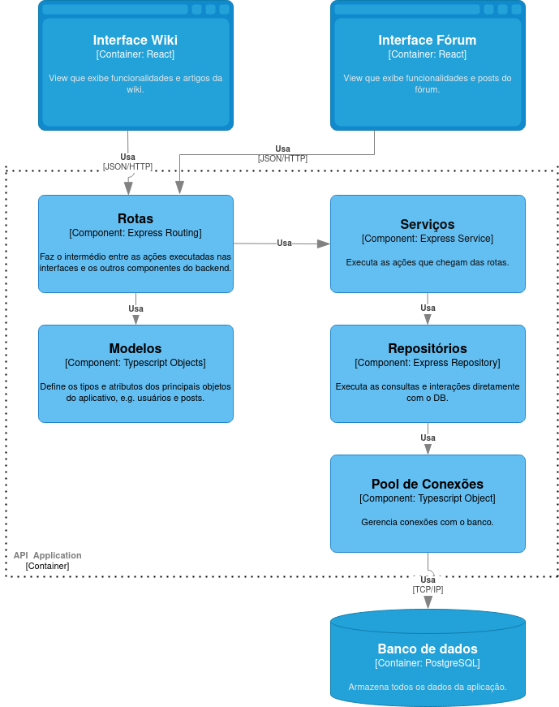

# Projeto Wiki + Repo

## Tema
Repositório/Wiki e fórum sobre conteúdos associados a disciplinas da Unicamp.

## Ideia
A ideia do projeto é desenvolver uma plataforma que possibilite a publicação, manutenção e edição de páginas (também chamados de artigos) que contenham conteúdo multimídia oferecido normalmente em disciplinas e que possam ser criadas colaborativamente, inclusive pelos alunos. Adicionalmente, a plataforma irá conter um fórum simples que possibilite com que alunos publiquem dúvidas e respostas sobre os conteúdos englobados.

## Integrantes

- Caio Petrucci dos Santos Rosa, 248245
- Gabriel Gardini, 246289
- Luan Augusto Fazolin, 182236
- Paulo Vinícius Pinto, 242863
- Gustavo Eugenio John, 248318

# Diagrama arquitetural (C4 - Nível 3)

Abaixo um diagrama em nível de componentes (C4 - Nível 3) para a arquitetura da aplicação.

# Descrição dos componentes

## Interface Wiki
É a parte da View em que são exibidas as funcionalidades da Wiki da aplicação Wiki+Forum. Dentre elas, constam a listagem, busca e exibição de artigos, com a possibilidade de visualiar os posts e threads do fórum relacionados aos artigos. A partir dela, é possível mudar para a interface Fórum e vice-versa;

## Interface Fórum
É a parte da View em que são exibidas as funcionalidades do Fórum. Dentre elas, constam a exibição de posts, listagem de threads do fórum, interações com posts (como curtidas e comentários) e artigos relacionados ao post ou à thread. A partir dela, é possível mudar para a interface da Wiki e vice-versa;

## Rotas
É o componente da aplicação que recebe os dados obtidos por meio das interfaces e faz os redirecionamentos necessários para os demais componentes para que as ações sejam executadas. Pode-se citar como exemplo as rotas de autenticação e de criação e listagem de posts, comentários, artigos, mensagens e curtidas.

## Serviços
Executa as ações (ou melhor dizendo, as funções) requeridas no componente Rotas. Pode-se citar como exemplos a validação de campos, a confirmação de existência de um usuário, a encriptação de dados sensíveis (como senha do usuário). Eles também se comunicam com os repositórios para inserção e obtenção de dados do pool de conexões - que gerencia as consultas do banco de dados.

## Modelos
É onde os objetos utilizados na aplicação têm seus atributos e tipos definidos – a nível de servidor – estando em conformidade com o que já foi tipado e é no recebimento dos dados a partir das rotas e, posteriormente, no banco de dados.

## Repositórios
Utilizando tanto o que é definido nos Modelos quanto as ações recebidas pelos Serviços, realiza as interações diretamente com o Pool de Conexões, que é responsável por gerencial as conexões com o banco de dados.

## Pool de Conexões
Gerencia e reutiliza as conexões com o banco de dados sempre que uma solicitação é realizada através dos repositórios. 

## Banco de dados
Armazena todos os dados da aplicação, como tabelas de dados de usuários, posts, artigos, respostas, curtidas e comentários.

# Estilo arquitetural
Para a nossa aplicação, adotamos principalmente o estilo MVC. O estilo MVC (Model-View-Controller) é baseado em uma divisão do sistema que estabelece uma View – que representa a interface exposta ao usuário – um Model – que define a estrutura dos dados e cuida da lógica da aplicação – e um Controller, responsável por receber os inputs da View e direcioná-los ao Model, podendo também em alguns casos atualizar diretamente o que é exibido na View.

Dito isso, entendemos que o MVC seria o mais razoável para nossa aplicação pois orienta a organização de nossos componentes de maneira que faz sentido: as interfaces, tanto da Wiki, quanto do Fórum, atuam como a View; o Controller é representado pelo componente Rotas do back-end, enquanto os outros componentes do back-end juntos à atuação do banco de dados constituem o Model, visto que são diretamente responsáveis pela execução das ações e modificações dos dados na aplicação.