# Elicitação

## Como técnicas de elicitação de requisitos, usamos tanto brainstorming quanto benchmarking. Como já havíamos realizado brainstorming previamente à atividade e não temos material que sirva como evidência, optamos por compartilhar na submissão da avaliação A3 os conteúdos do benchmarking.

## Nossa aplicação se trata de um misto entre uma wiki e um fórum, portanto tomamos como referência os fóruns e wikis mais prototípicos para realizar a elicitação. Para as wikis, selecionamos Wikipedia e WikiHow; para os fóruns, escolhemos Reddit e Quora. Abaixo segue uma análise de cada um deles e, ao fim, uma tabela que sintetiza e compara funcionalidades de destaque.

## Em vez de elicitarmos de maneira exaustiva todas as funcionalidades das aplicações selecionadas para o benchmarking, focamos nas funcionalidades que mais interessam à nossa aplicação, dentre elas a exibição de posts/artigos, a criação e edição deles, maneiras para os usuários interagirem com esses posts e artigos e também de interagirem entre si.

# Wikipedia

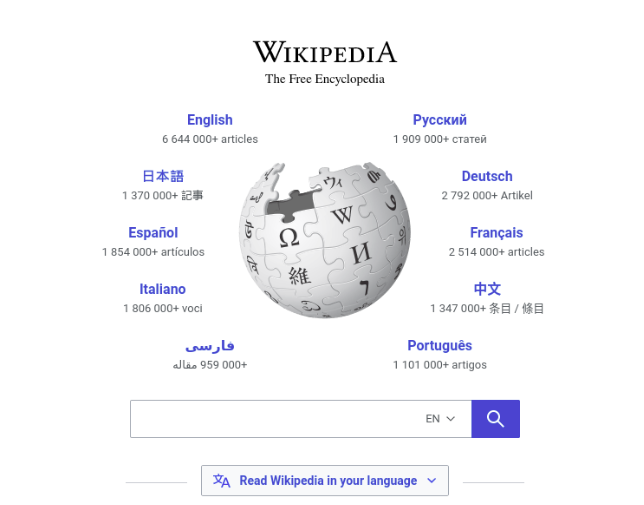

### Na tela inicial, podemos destacar como principais funcionalidades a barra de pesquisa e seleção de idioma.

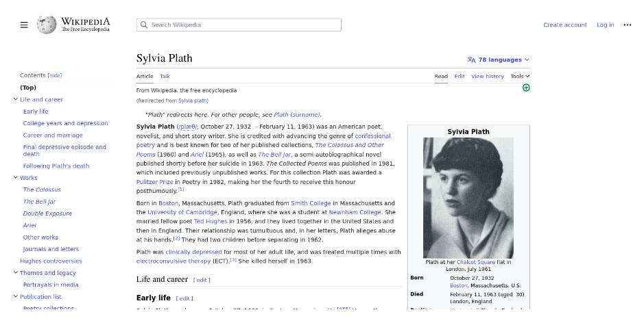

### No início da tela principal de um artigo, vemos um menu à esquerda, que permite selecionar uma seção do artigo. Outras funcionalidades e telas acessíveis a partir desta tela são a barra de pesquisa, discussão sobre edição do artigo, edição do artigo, histórico de edições, ferramentas e login.

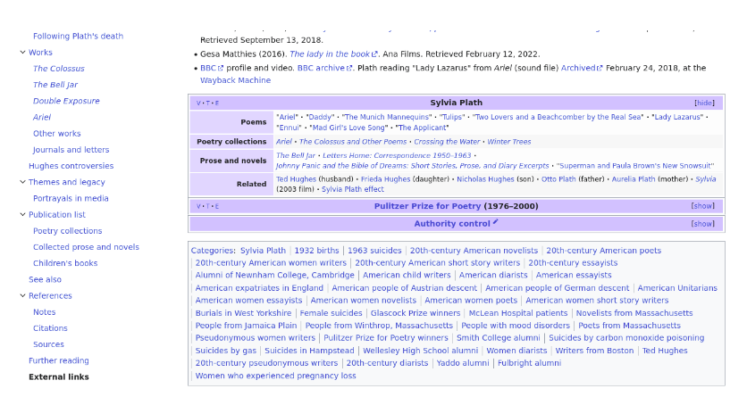

### Ao fim da mesma tela, o que mais se destaca são as sugestões de artigos relacionados e tags.

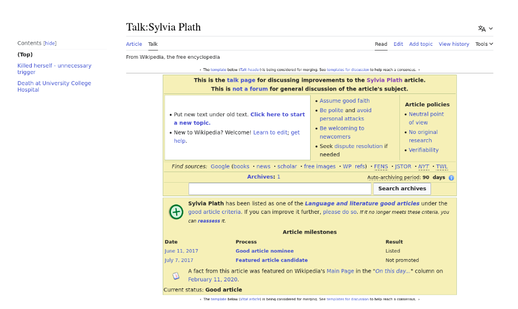

### Na tela de discussão sobre edição do artigo, vemos a indicação de diversos links para guideline e uma divisão de discussões dentro da própria página.

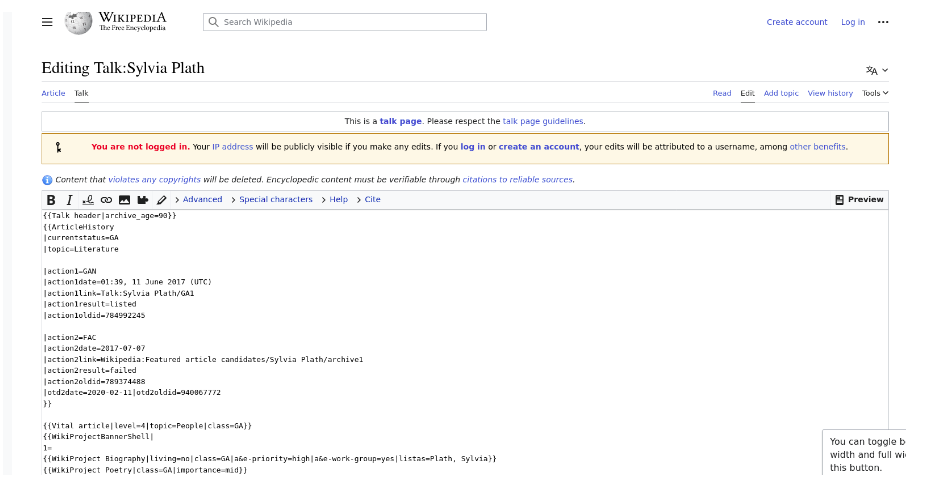

### Já na tela de edição do artigo, além da maioria de acessos disponíveis em outras telas, vemos também a opção de preview do post editado

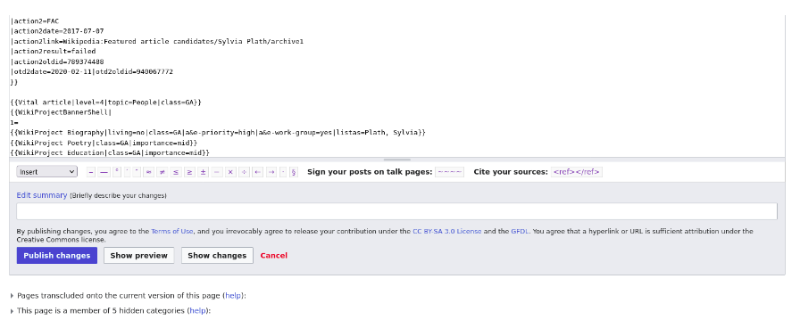

### Ao fim da tela de edição do artigo, vemos novamente a opção de preview do artigo editado, além do botão para publicar artigo e exibir mudanças da edição.

# WikiHow

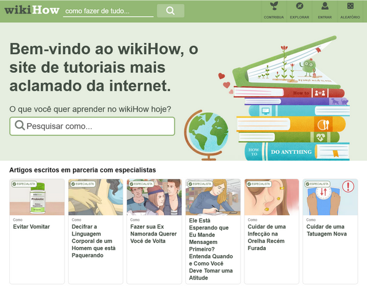

### Na tela inicial, vemos funcionalidades como barra de pesquisas, explorar, cadastro, exibição de artigo aleatório e listagem de artigos recomendados.

### No topo da tela de um artigo, vemos que a barra de pesquisas é mantida, assim como outras funcionalidades da tela inicial – explorar, cadastro, exibição de artigo aleatório.

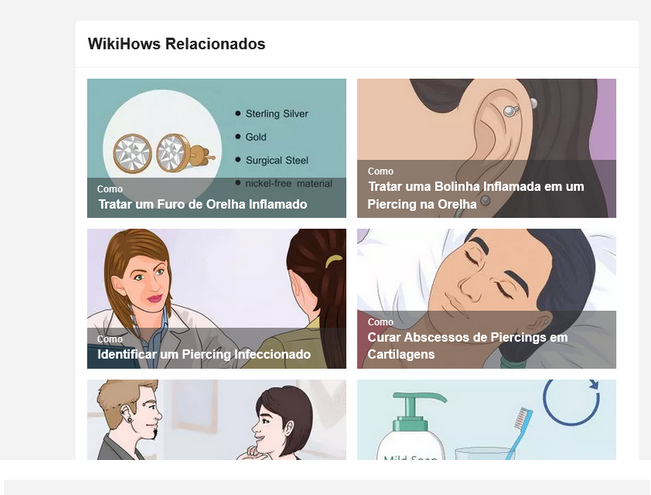

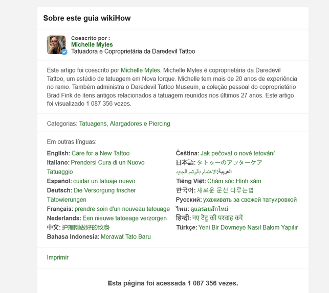

### As duas imagens acima fazem parte do fim da tela do artigo. Nelas é possível ver que há sugestão de artigos relacionados, informação sobre autor(es) e seleção de idiomas.

# Reddit

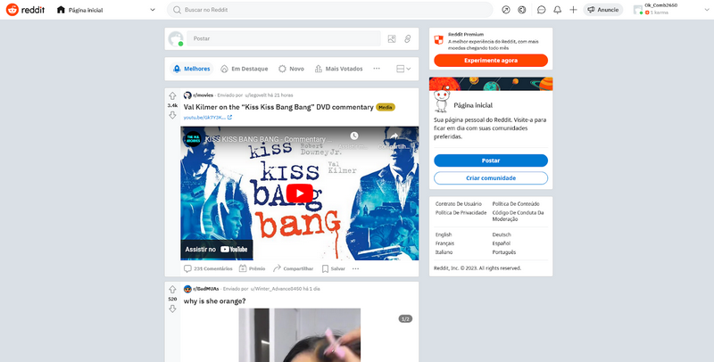

### Na tela inicial, dentre as principais funcionalidades, vemos um filtro de posts (Melhores, Em destaque, Novo, Mais votados…), barra de busca, e uma barra para criar post.

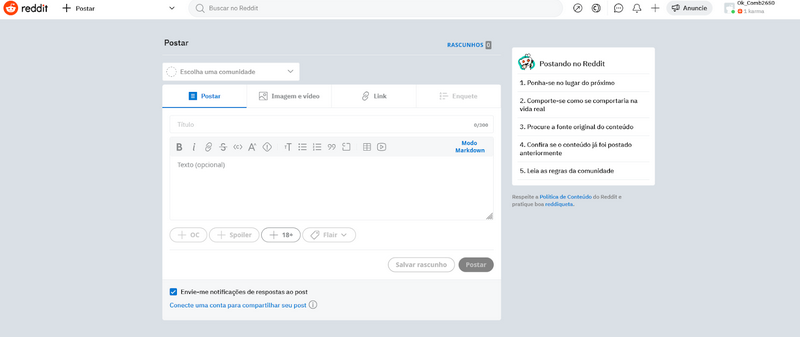

### Na tela de criação de post, temos a barra de busca, seleção do grupo/comunidade em que o post será criado, anexos e rascunhos.

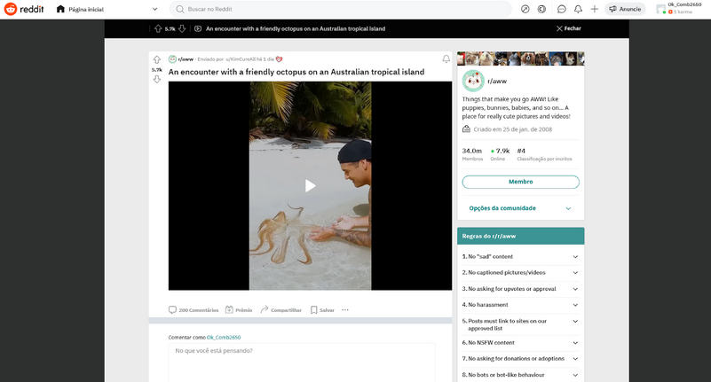

### Na tela de exibição de um post, é possível votar no post no post e comentar.

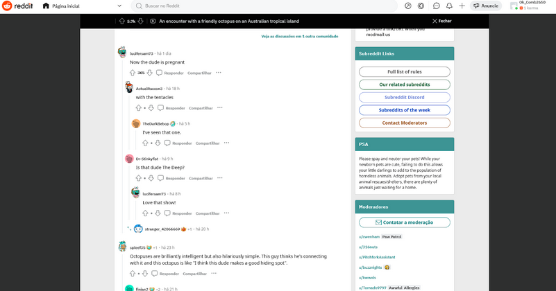

### Ainda na mesma tela, vemos os comentários de outros usuários e as possibilidades de interação com cada uma das respostas: votar no comentário, responder comentário e compartilhar comentário. Também vemos a possibilidade de contatar a moderação.

# Quora

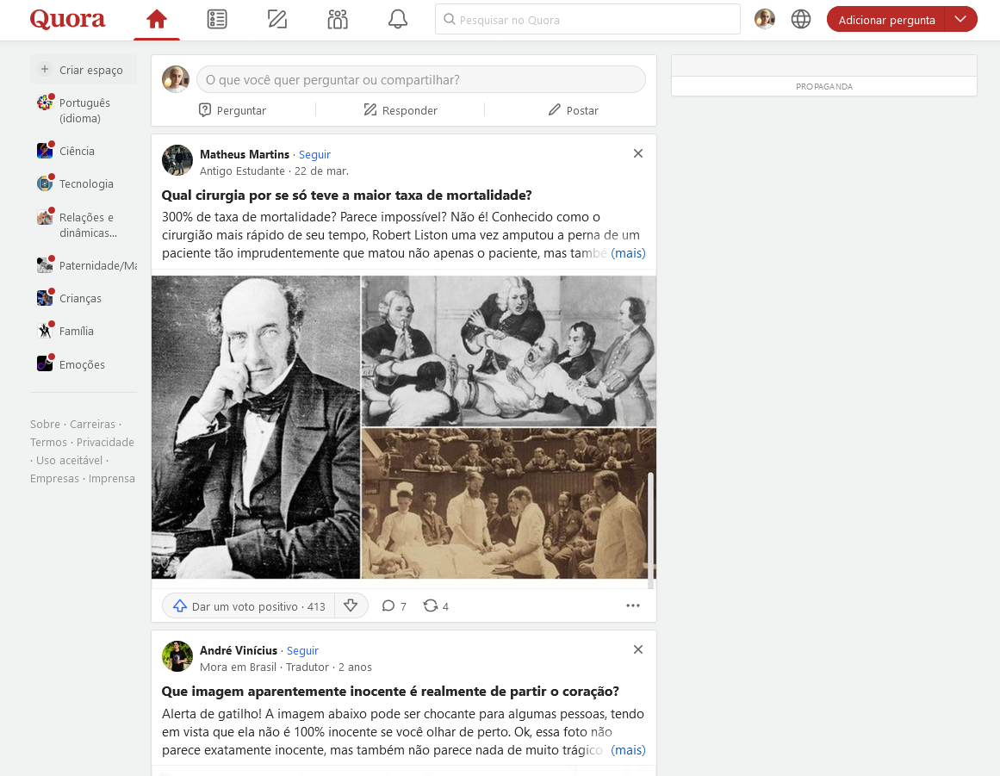

### Na tela inicial, dentre as principais funcionalidades vemos a barra de pesquisa, criar post – que sintetiza as ações de “Perguntar”, “Responder” e “Postar” –, votar, seguir um usuário e selecionar tópico (menu à esquerda).

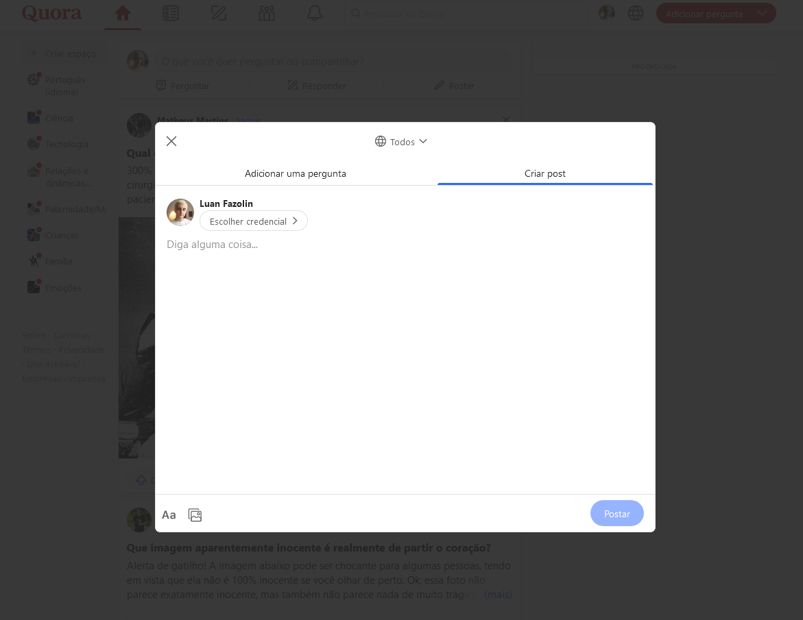

### A tela de criação de post é uma modal view. Não há nenhuma funcionalidade de destaque a não ser a opção de anexos, em específico, do anexo de imagem.

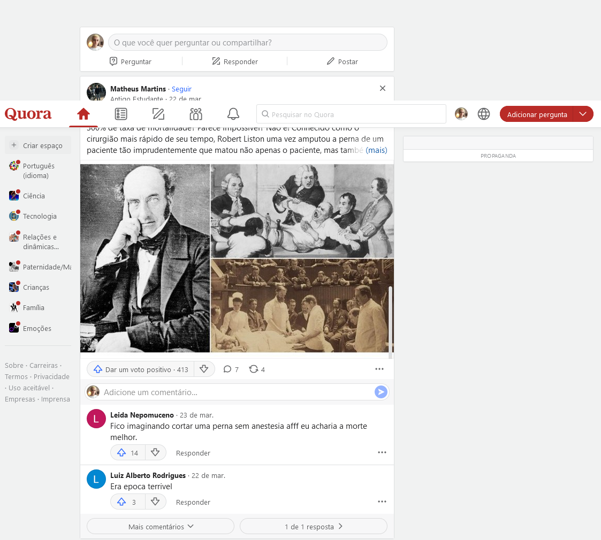

### No Quora não é aberta uma nova tela quando clicamos em um post/pergunta, mas clicando nos comentários é possível ver que, referente aos comentários, podemos votar no comentário ou responder comentário.

# Resultados do benchmarking
Em vez de construir uma tabela comparando as funcionalidades, dado que fizemos uma análise mais minuciosa de poucos exemplos e que quase não há divergência entre as funcionalidades principais tanto das wikis quanto dos fóruns, preferimos listar as funcionalidades que podem ser mais interessantes aplicar em nosso projeto, tendo em mente o escopo deste. Assim, as funcionalidades das wiki que podem ser aplicadas em nosso projeto são as seguintes:

- Pesquisar artigo
- Selecionar seção do artigo
- Discutir edição do artigo
- Visualizar histórico de edições
- Visualizar artigos relacionados
- Editar artigo
- Visualizar preview da edição
- Exibir artigo aleatório
- Visualizar artigos recomendados

Já para os fóruns extraímos as seguintes funcionalidades:
- Pesquisar post
- Filtrar post
- Criar post
- Votar em um post
- Comentar um post
- Votar em um comentário
- Responder um comentário
- Contatar a moderação
